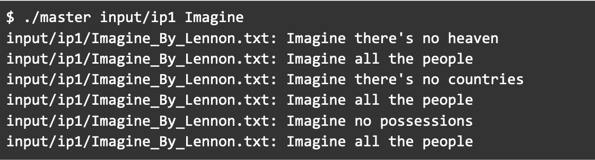
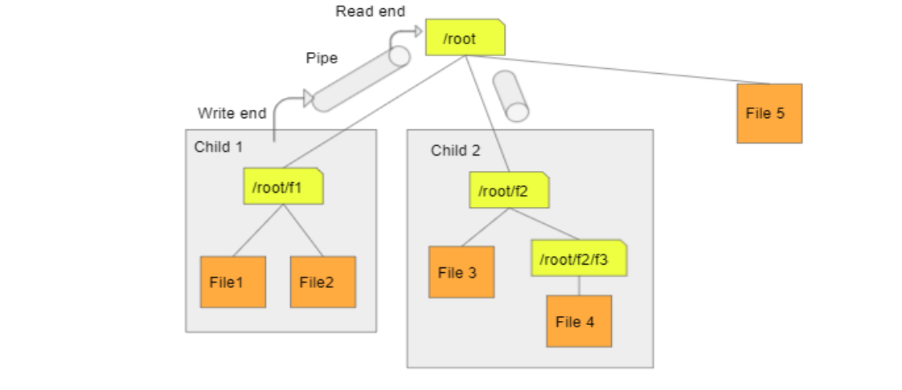

# **Parallel String Matching**

## **Background**

Grep is a linux command that is used to find patterns in each file. It prints each line that
matches the pattern. In this project I implemented “Parallel String Matching”, a program that
will search for a string in all files and subdirectories of a root directory using multiple
processes.

---

## **Project Overview**

I used File I/O, Pipes, directory operations, links and I/O redirection. In this project, I spawned
multiple child processes. Each child process is responsible for searching some portion of the root
directory and communicates the search results to the parent using pipes. Parent is responsible for
reading from these pipes and printing the output to the terminal. Only the parent prints the output
to the terminal.

---

## **Input**

This program takes 2 arguments:

- input_directory_path: The path to the root directory
- word_to_search: The string to be searched

```bash
>> ./master <input_directory_path> <word_to_search>   
```

---

## **Output**

The program will print all the lines containing **word_to_search**. 

The output format is as follows:
> [Path to the file containing word_to_search]: [Line containing the string]
>
> Example: 

---

## **String Matching**

String matching is case sensitive. Use of the strstr() function provided by the string library is
strongly recommended.

---

## **Child Processes and Root Directory**

The root directory may contain multiple first level subdirectories and files. One child process
needs to be created for every first level subdirectory. This child process is responsible for
searching all the files in its sub directories.

A pipe must also be created for every child. Pipe is used by the child to communicate the results
back to the parent.

Consider a possible directory structure as shown in Fig 1. Here, the root directory ***/root***
contains 2 first level subdirectories, namely ***/root/f1*** and ***/root/f2***. Child 1 as shown
in the figure, is responsible for searching files in ***/root/f1***. Child 2 as shown in the figure
is responsible for searching files in ***/root/f2***.  
Note that no new child is created for the ***/root/f2/f3*** directory. **Child processes are only**
**created for the first level directories**.  
Also, note that parent is responsible for searching first level files (in this case File 5) and no
new child is created for this.


**Fig. 1**

---

## **Pipes and I/O Redirection**

Pipe will be used by the child to communicate search results to the parent. Parent reads from the
pipe and prints it to the console. Each child’s STDOUT must be redirected to the write end of the
pipe. One pipe must be created for each child process. In Fig 1, two pipes are created, one for
each child.

---

## **Directory Traversal and Soft Links**

Each child process needs to traverse the sub-directory assigned to it recursively, searching every
file in its directory sub structure and writing search results to the pipe. A file may be a regular
file, link, directory etc. While traversing the directory, make sure to not parse soft links files.

---

## **Project Folder Structure**

The project folder contains “include”, “lib”, “src”, “input” and “output” folders, as well as Makefile, README and two executables.

1. **include** folder: .h header files
2. **lib** folder: .o library files
3. **src** folder: .c source files
4. **input** folder: contains input folders
5. **output** folder: Use *"make run"* to create output files for all test cases
6. **Two executables**: master and child

---

## **Execution Syntax**

### **Run Master Program Directly**

```bash
>> ./master <input_directory_path> <word_to_search>  
```

### **Run Test Cases**

For test case 1:

```bash
make run1
```

For test case 2:

```bash
make run2 
```

And so on...
